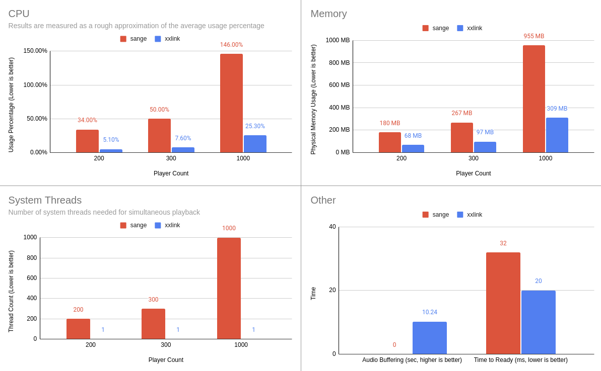

# xxlink
This project is a WIP.

## Benchmarks

Notes
- [sange](https://github.com/davidzeng0/sange) is roughly on par or better with lavaplayer+lavalink in performance
- with opus repacketizing, performance can be increased an extra 2.6x (cumulative ~16x faster) than sange when processing opus streams (like those from YouTube or Soundcloud)

